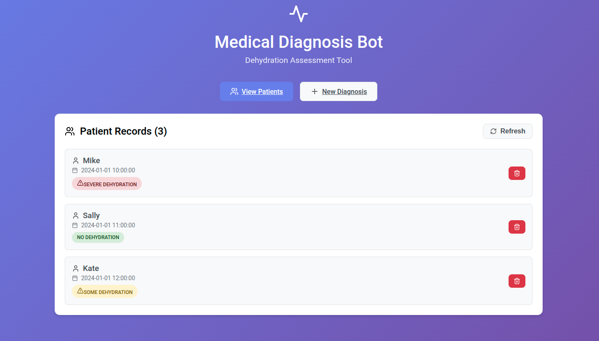

# 🏥 Medical Diagnosis Chatbot

A modern, professional web application for medical diagnosis assessment, specifically focused on dehydration evaluation. Built with Python Flask backend and React frontend.



*Professional medical interface showing patient records with color-coded diagnosis badges*

## ✨ Features

### 🏥 Medical Assessment
- **Systematic Dehydration Diagnosis**: Based on clinical decision trees and medical protocols
- **Interactive Assessment Form**: Step-by-step patient evaluation with guided questions
- **Three-Tier Diagnosis System**: No dehydration, Some dehydration, Severe dehydration
- **Clinical Validation**: Real-time input validation and error handling

### 📊 Patient Management
- **Patient Records Dashboard**: Clean, organized view of all patient diagnoses
- **Color-Coded Diagnosis Badges**: Visual indicators for quick assessment review
  - 🟢 **Green**: No dehydration
  - 🟡 **Yellow**: Some dehydration  
  - 🔴 **Red**: Severe dehydration
- **Timestamp Tracking**: Automatic recording of assessment date and time
- **CRUD Operations**: Create, view, and delete patient records

### 🎨 Professional Interface
- **Modern Medical Theme**: Purple gradient design with clean, clinical aesthetics
- **Responsive Design**: Optimized for desktop, tablet, and mobile devices
- **Intuitive Navigation**: Easy switching between patient list and new diagnosis
- **Accessibility Features**: Keyboard navigation and screen reader support
- **Loading States**: User feedback during data operations

## 🚀 Quick Start

### Prerequisites
- Python 3.8+ installed
- Node.js 16+ installed
- Git (for cloning)

### 1. Clone & Setup
```bash
git clone https://github.com/MSMITH71910/medical-diagnosis-Bot-Webapp.git
cd medical-diagnosis-Bot-Webapp
```

### 2. Start Backend (Terminal 1)
```bash
./start-backend.sh
```
*Backend will start on http://localhost:5000*

### 3. Start Frontend (Terminal 2)
```bash
./start-frontend.sh
```
*Frontend will start on http://localhost:3000*

### 4. Access the Application
Open your browser and navigate to **http://localhost:3000**

🎉 **You're ready to start diagnosing patients!**

## 🖥️ User Interface

The application features a clean, professional medical interface as shown in the screenshot above:

### 📋 Patient Records Dashboard
- **Header Section**: Medical heartbeat icon with application title and subtitle
- **Navigation Bar**: Toggle between "View Patients" and "New Diagnosis" 
- **Patient Cards**: Each patient record displays:
  - 👤 Patient name with user icon
  - 📅 Assessment timestamp
  - 🏷️ Color-coded diagnosis badge (Green/Yellow/Red)
  - 🗑️ Delete button for record management
- **Refresh Button**: Update patient list with latest data

### 📝 New Diagnosis Form
- **Step-by-step Assessment**: Guided medical evaluation process
- **Radio Button Options**: Clear choices for each assessment criteria
- **Real-time Validation**: Prevents incomplete submissions
- **Success Feedback**: Confirmation of completed diagnosis

### 🎨 Visual Design Elements
- **Purple Gradient Background**: Professional medical aesthetic (#667eea to #764ba2)
- **White Card Layout**: Clean, card-based design for content organization
- **Medical Icons**: Heartbeat, user, calendar, and medical symbols throughout
- **Color-Coded Badges**: 
  - 🟢 Green for "No Dehydration" (safe)
  - 🟡 Yellow for "Some Dehydration" (caution)
  - 🔴 Red for "Severe Dehydration" (critical)
- **Consistent Typography**: Clean, readable fonts optimized for medical use

## 🔬 Assessment Logic

The application follows a clinical decision tree for dehydration assessment:

1. **General Appearance Assessment**
   - Normal appearance → Eye examination
   - Irritable/lethargic → Skin pinch test

2. **Follow-up Assessments**
   - **Eyes**: Normal/slightly sunken vs. very sunken
   - **Skin**: Normal pinch vs. slow pinch

3. **Diagnosis Results**
   - **No dehydration**: Normal appearance + normal/slightly sunken eyes
   - **Some dehydration**: Irritable/lethargic + normal skin pinch
   - **Severe dehydration**: Normal appearance + very sunken eyes OR irritable/lethargic + slow skin pinch

## 🛠️ Technology Stack

### 🐍 Backend Technologies
- **Python 3.8+** - Core programming language
- **Flask 2.3.3** - Lightweight web framework
- **Flask-CORS 4.0.0** - Cross-origin resource sharing
- **JSON** - Simple file-based data storage (easily upgradeable to SQL)

### ⚛️ Frontend Technologies
- **React 18** - Modern UI framework with hooks
- **React Router 6** - Client-side routing and navigation
- **Lucide React** - Professional medical icons
- **CSS3** - Custom responsive styling with medical theme
- **Fetch API** - HTTP client for backend communication

### 🔧 Development Tools
- **Virtual Environment** - Isolated Python dependencies
- **npm** - Node.js package management
- **Bash Scripts** - Automated startup procedures
- **JSON Database** - Persistent data storage

## Project Structure

```
medical-diagnosis-bot/
├── backend/
│   ├── app.py              # Flask application
│   ├── requirements.txt    # Python dependencies
│   └── patients_data.json  # Data storage (auto-generated)
├── frontend/
│   ├── public/
│   │   └── index.html
│   ├── src/
│   │   ├── components/
│   │   │   ├── PatientList.js
│   │   │   └── DiagnosisForm.js
│   │   ├── App.js
│   │   ├── App.css
│   │   ├── index.js
│   │   └── index.css
│   └── package.json
├── main.py                 # Original CLI version
└── README.md
```

## Installation & Setup

### Prerequisites
- Python 3.8 or higher
- Node.js 16 or higher
- npm or yarn

### Backend Setup

1. Navigate to the backend directory:
   ```bash
   cd backend
   ```

2. Create a virtual environment:
   ```bash
   python -m venv venv
   source venv/bin/activate  # On Windows: venv\Scripts\activate
   ```

3. Install dependencies:
   ```bash
   pip install -r requirements.txt
   ```

4. Run the Flask server:
   ```bash
   python app.py
   ```

The backend will start on `http://localhost:5000`

### Frontend Setup

1. Navigate to the frontend directory:
   ```bash
   cd frontend
   ```

2. Install dependencies:
   ```bash
   npm install
   ```

3. Start the development server:
   ```bash
   npm start
   ```

The frontend will start on `http://localhost:3000`

## Usage

1. **Access the Application**: Open `http://localhost:3000` in your browser

2. **View Patients**: The home page shows all patient records with their diagnoses

3. **New Diagnosis**: Click "New Diagnosis" to assess a new patient:
   - Enter patient name
   - Select general appearance
   - Complete follow-up assessment based on appearance
   - Submit for diagnosis

4. **Manage Records**: Delete patient records as needed

## API Endpoints

### GET /api/patients
Returns all patient records

### POST /api/diagnosis
Creates a new diagnosis
```json
{
  "name": "Patient Name",
  "appearance": "1" | "2",
  "eyes": "1" | "2" (if appearance is "1"),
  "skin": "1" | "2" (if appearance is "2")
}
```

### DELETE /api/patient/:id
Deletes a patient record

### GET /api/health
Health check endpoint

## Development

### Running Tests
```bash
# Backend tests (if implemented)
cd backend
python -m pytest

# Frontend tests
cd frontend
npm test
```

### Building for Production
```bash
# Frontend build
cd frontend
npm run build
```

## Contributing

1. Fork the repository
2. Create a feature branch
3. Make your changes
4. Add tests if applicable
5. Submit a pull request

## License

This project is for educational purposes. Please ensure compliance with medical software regulations if used in clinical settings.

## 🔄 Transformation: CLI to Web App

This project successfully transformed a basic command-line medical diagnosis tool into a modern, professional web application:

### Before (CLI Version)
- ❌ Text-based terminal interface
- ❌ No data persistence
- ❌ Single-user, local access only
- ❌ Basic input validation
- ❌ No visual feedback

### After (Web App Version)
- ✅ Modern, responsive web interface
- ✅ Persistent JSON database storage
- ✅ Multi-user web access
- ✅ Comprehensive validation and error handling
- ✅ Professional medical UI with visual indicators
- ✅ Real-time updates and feedback
- ✅ Mobile-friendly responsive design
- ✅ RESTful API architecture

## 📸 Screenshots

The main interface showcases a professional medical dashboard with:
- Clean patient record cards showing diagnosis history
- Color-coded medical badges for quick visual assessment
- Intuitive navigation between patient list and new diagnosis forms
- Professional medical theming with purple gradient background

## ⚠️ Disclaimer

This application is for educational and demonstration purposes only. It should not be used as a substitute for professional medical advice, diagnosis, or treatment. Always consult with qualified healthcare professionals for medical decisions.